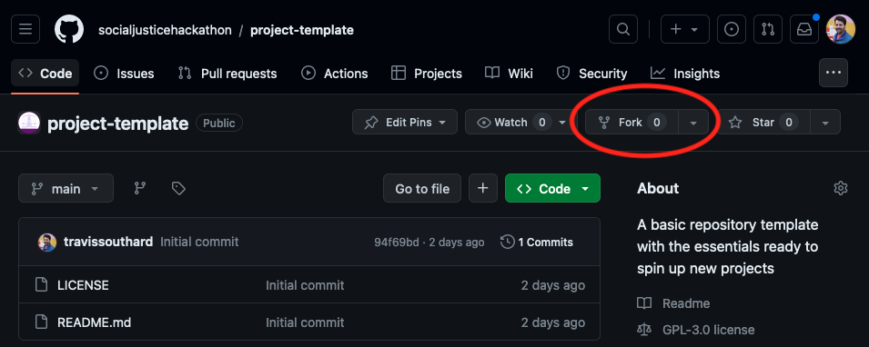
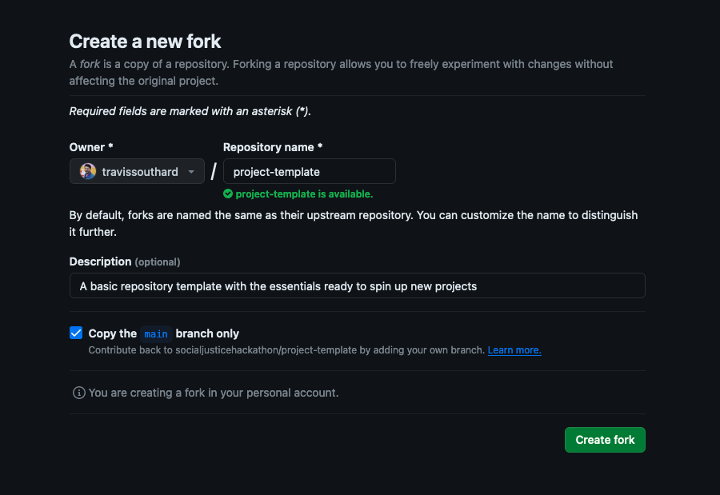

# SJH Project Template

## Overview

A basic repository template with the essentials ready to spin up new projects. This template sets up for GitHub specifically including some conventions for automating processes.

This template does not prescribe any specific technologies. Your project team should determine the appropriate tech to use to solve your specific requirements and should follow the repository conventions for that tech as appropriate.

What is included here is to get some of the more tedious GitHub things out of the way so that you can get started coding as soon as you are ready. This template should set you up for success and help you create a project repository ready for volunteers to jump in.

## Usage

This template is meant to be forked, and then edited to make it ready for your team to use.

### Forking

For project repos hosted in the `socialjusticehackathon` GitHub organization, this step should be done by a Social Justice Hackathon organizer, but just in case (or for them to follow):

On the project template repo page, click the `Fork` button as shown below:



Then in the next page (shown below), replace `project-template` with a hyphenated name of the project, and a description of the project. We recommend keeping the checkbox for only forking the `main` branch for a cleaner start to the project's `git` files



### Renaming Project Name

For now the only PROJECT-NAME in the project that needs to be renamed is in the first header of the [`README-example.md`](./README-example.md) page. That should be changed to the name of your project.

### Adding your own instructions

In the [`README-example.md`](./README-example.md), you will have to fill out your own instructions to setup, develop, and deploy the project. This may not be very fleshed out yet since this is the beginning of the project, but as you build your project, filling out the corresponding sections will make your volunteers' lives easier (as well as your own later!)

### Making it your project

There are a few files here that are just to get new projects set up but aren't needed once the project starts. To remove extraneous files and move the files we want to keep in the project to the right places, we have included these commands to run in your terminal (Windows users may need to follow different steps for WSL or PowerShell):

```sh
# Remove README
rm README.md

# Make the example README the new README
mv README-example.md README.md

# Remove the example photos about forking
rm -rf assets
```
